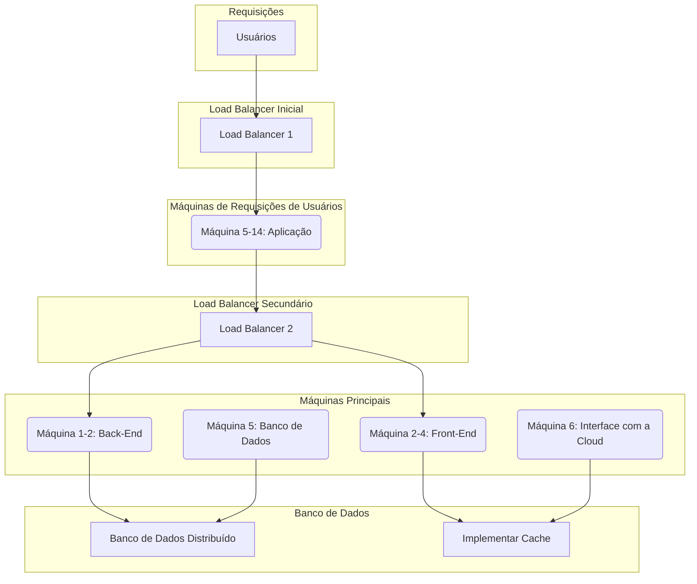

**Resolução:**

Para a expansão do software, será necessário fazer uma "quebra" dos componentes daquele software. Por exemplo, o back-end deverá estar rodando em uma máquina, o front-end em outra, e assim por diante.

- **Máquina 1:** Aplicação de back-end (Java com Spring Boot)
- **Máquina 2:** Aplicação de front-end (Angular)
- **Máquina 3:** Banco de dados espelhados e usando o recurso de redundância (se ocorre o erro em um, o outro assume)
- **Máquina 4:** Fazendo o contato da aplicação com a Cloud
- **Máquinas 5-14:** Estarão lidando com as requisições e acessos dos usuários

### 1. Escalonamento Horizontal e Vertical
- **Escalonamento Vertical:** Aumentar os recursos das máquinas individuais, como adicionar mais CPUs e memória RAM.
- **Escalonamento Horizontal:** Adicionar mais servidores para distribuir a carga, especialmente com o crescimento de usuários simultâneos.

### 2. Load Balancing
- **Implementar um load balancer:** Adicionar um load balancer na frente das máquinas 1 (Back-End), 2 (Front-End), e nas máquinas 5-14 (Requisições e acessos de usuários). Isso irá distribuir as requisições de forma equitativa entre várias instâncias, reduzindo a carga em servidores individuais e melhorando a latência.

### 3. Microservices Architecture
- **Migração para microservices:** Isso permitirá escalar independentemente componentes específicos do sistema, como gestão de usuários, matrículas, etc.

### 4. Banco de Dados Distribuídos e Cache
- **Banco de Dados Distribuído:** Em vez de um único servidor, utilize um banco de dados distribuído ou partições para melhorar o desempenho e a redundância. Pode-se considerar o uso de PostgreSQL em cluster ou até mesmo uma solução em nuvem como o Amazon RDS.
- **Implementar Cache:** Um sistema de cache como Redis para armazenar dados frequentemente acessados e reduzir a carga no banco de dados, melhorando assim a latência.

### 5. Armazenamento e Processamento de Arquivos
- **Armazenamento em Nuvem:** Use um serviço de armazenamento na nuvem, como Amazon S3 ou Google Cloud Storage, para armazenar grandes volumes de dados acadêmicos e documentos, aliviando a carga do servidor local.
- **CDN (Content Delivery Network):** Utilize uma CDN para distribuir o conteúdo estático, como arquivos grandes e documentos, para reduzir a latência e melhorar o desempenho.

### 6. Otimização de Rede e Segurança
- **Network Optimization:** Otimizar a rede para garantir que a comunicação entre os serviços e os usuários seja rápida e eficiente, utilizando técnicas como compressão de dados, HTTP e WebSockets.
- **Segurança:** Implementar medidas de segurança robustas, incluindo firewalls, criptografia de dados em trânsito e em repouso, e monitoramento de tráfego para garantir a integridade e disponibilidade do sistema.

### 7. Monitoramento e Manutenção
- **Monitoramento em Tempo Real:** Use ferramentas como Prometheus, Grafana ou New Relic para monitorar o desempenho do sistema, detectando problemas de latência e disponibilidade em tempo real.
- **CI/CD (Continuous Integration/Continuous Deployment):** Implementar pipelines de CI/CD para garantir que as atualizações e patches sejam implantados de forma eficiente e com o mínimo de tempo de inatividade.

### 8. Consideração para Alta Disponibilidade
- **Cluster e Failover:** Configurar clusters e failover tanto para o banco de dados quanto para o backend e frontend, garantindo que, no caso de falha em uma máquina, outra possa assumir rapidamente.
- **Service Mesh:** Considere usar uma malha de serviços como Istio ou Linkerd para gerenciar a comunicação entre microservices, balanceamento de carga interno e políticas de resiliência.

### 9. Especificações Atualizadas das Máquinas
- **Máquina 1 e 2 (Backend e Frontend):**
    - 32 GB RAM
    - 2 TB NVMe SSD
    - Processador com 8-12 núcleos (Xeon ou AMD EPYC)
    - Load balancer na frente

- **Máquina 3 (Banco de Dados Distribuído):**
    - 64 GB RAM
    - 2 TB NVMe SSD (com suporte a mais storage)
    - Processador com 16 núcleos (Xeon ou AMD EPYC)
    - Backup automatizado e sistema de failover

- **Máquina 4 (Interface com a Cloud e CDN):**
    - 32 GB RAM
    - 1 TB NVMe SSD
    - Processador com 8-12 núcleos (Xeon ou AMD EPYC)

- **Máquinas 5 a 14 (Requisições de Usuários):**
    - 16 GB RAM
    - 500 GB SSD
    - Processador com 4-8 núcleos (Xeon ou AMD EPYC)
    - Load balancer na frente para distribuir as requisições dos usuários entre as máquinas.

